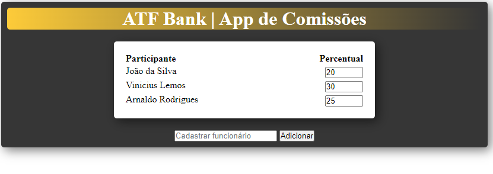

<h1 align="center">Comissões App</h1>

**<p align="center">Sumário</p>**
<p align="center">
<a href="#dart-sobre">Sobre</a> &#xa0; | &#xa0;
<a href="#computer-tecnologias">Tecnologias</a> |
<a href="#books-O-que-eu-aprendi">O que aprendi</a> &#xa0; 
</p>
<p align="center">
<a href="#hammer_and_wrench-serviços">Serviços</a> &#xa0; | &#xa0;
<a href="#scroll-rodando-o-projeto">Rodando o projeto</a> &#xa0; | &#xa0;
<a href="#sparkles-autor">Autor</a>
</p>

&#xa0;
 
## :dart: Sobre
<p>Esta aplicação é fruto de um teste técnico.</p>
<p>A ideia é que possa cadastrar funcionários envolvidos no ganho de uma comissão.</p>

<h1 align="center">Resultado</h1>
<div align="center">

### Print


</div>

### Deploy: 

&#xa0;

## :computer: Tecnologias
* [HTML](https://developer.mozilla.org/pt-BR/docs/Web/HTML)

* [CSS](https://www.w3schools.com/css/)

* [JavaScript](https://www.javascript.com/)

&#xa0;

## :hammer_and_wrench: Serviços
* <a href="https://github.com/">GitHub</a>

&#xa0;

## :books: O que eu aprendi?

📌 Manipular elementos do HTML de forma dinâmica.

📌 Fazer validação de campo obrigatório.

&#xa0;

## :scroll: Rodando o projeto
É necessário um navegador

```bash
# Clone este repositório
$ git clone https://github.com/viniciuslemos93/comissoes-app.git

# Acesse a pasta do projeto e abra o arquivo index.html no navegador
```

&#xa0;

## :sparkles: Autor

<h4>Desenvolvido por Vinicius Lemos</h4>

<a href="https://github.com/viniciuslemos93">

</a>

&#xa0;

[](https://www.linkedin.com/in/viniciuslemos93/)<br>
